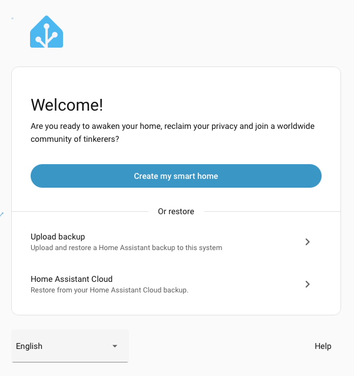
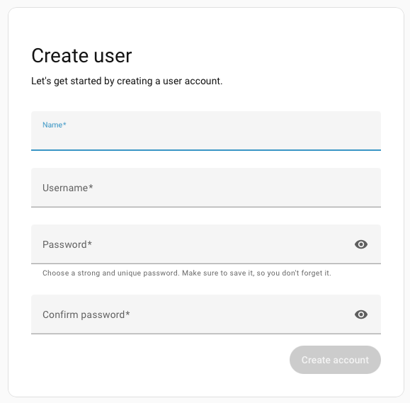
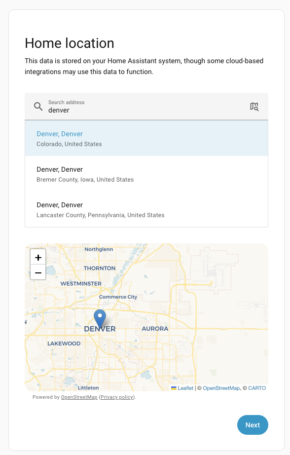
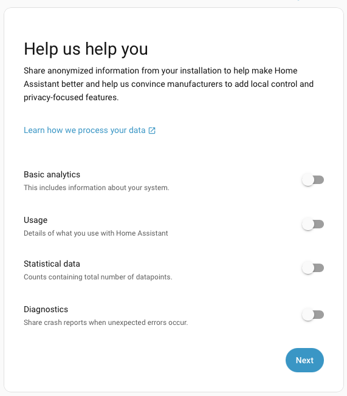
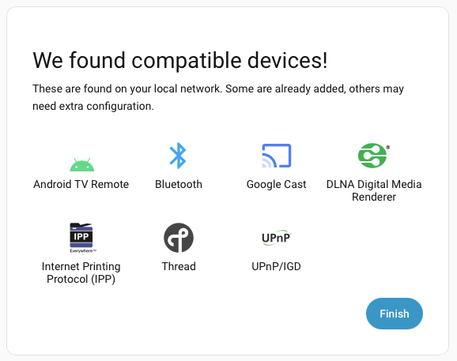
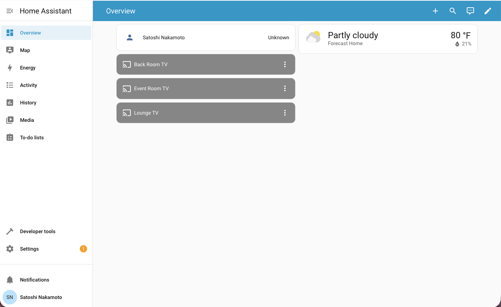

# System Configuration

This guide walks through installing Home Assistant OS on your Raspberry Pi and configuring it for Exergy integrations.

**Prerequisites:**
- Assembled Raspberry Pi hardware ([Hardware Setup](./rpi-ha-hardware.md))
- Components for your chosen flashing method (see [Raspberry Pi overview](./rpi-ha.md))

---

## Step 1: Flash Home Assistant OS

There are two methods to install Home Assistant OS on your NVMe SSD. Choose the one that fits your setup.

### Method A: Network Installer (Recommended)

This method uses the Raspberry Pi's built-in Network Installer. It's simpler if you have a display and keyboard available.

**What you need:**
- HDMI cable (some cases have full-size HDMI ports; otherwise use Micro-HDMI to HDMI)
- Monitor or TV with HDMI input
- USB keyboard
- Ethernet connected to your router

**Steps:**

1. **Connect display and keyboard**
   - Plug HDMI cable into your Pi and monitor/TV
   - Connect USB keyboard to Pi
   - Ensure Ethernet is connected

2. **Power on the Pi**
   - If your NVMe SSD is blank (no OS installed), the Pi will automatically boot into the Network Installer
   - You'll see the Raspberry Pi logo, then the installer interface

3. **Select Home Assistant OS**
   - Use the keyboard to navigate the installer menu
   - Select **Other specific-purpose OS**
   - Select **Home assistants**
   - Select **Home Assistant OS**
   - Choose the version for your Pi model (e.g., Pi 5)

4. **Select your NVMe drive**
   - Choose your NVMe SSD as the installation target
   - Confirm the selection

5. **Wait for installation**
   - The installer will download and flash Home Assistant OS
   - This may take 5-15 minutes depending on your internet speed

6. **Reboot**
   - Once complete, the Pi will reboot automatically
   - You can disconnect the HDMI and keyboard after this

---

### Method B: Raspberry Pi Imager (Alternative)

This method flashes the NVMe SSD from your computer before installing it in the Pi case. Use this if you don't have a display/keyboard, or prefer to flash beforehand.

**What you need:**
- NVMe-to-USB adapter/enclosure
- Computer (Mac, Windows, or Linux)

**Steps:**

1. **Connect NVMe to your computer**
   - Insert the NVMe SSD into your USB adapter
   - Connect the adapter to your computer

2. **Download Raspberry Pi Imager**
   - Go to [raspberrypi.com/software](https://www.raspberrypi.com/software/)
   - Download and install the Imager for your operating system

3. **Open Raspberry Pi Imager**

4. **Select your device**
   - Click **Choose Device**
   - Select your Raspberry Pi model (e.g., Raspberry Pi 5)

5. **Select the operating system**
   - Click **Choose OS**
   - Select **Other specific-purpose OS**
   - Select **Home assistants**
   - Select **Home Assistant OS**
   - Choose the correct variant for your Pi

6. **Select storage**
   - Click **Choose Storage**
   - Select your NVMe SSD (be careful to select the correct drive!)

7. **Write the image**
   - Click **Next**
   - When asked to customize settings, select **No** (Home Assistant handles this)
   - Click **Yes** to confirm
   - Wait for the write and verification to complete

8. **Install the NVMe in your Pi**
   - Safely eject the drive from your computer
   - Install the NVMe SSD into your Pi case/HAT
   - Connect Ethernet and power

---

## Step 2: First Boot

After flashing, the first boot takes longer than normal. Home Assistant needs to:
- Resize partitions to use the full SSD
- Download and install updates
- Initialize the database

**Wait 10-20 minutes** before attempting to access Home Assistant. The Pi's activity LED will flash during this process.

---

## Step 3: Access Home Assistant

Once the first boot is complete, you can access Home Assistant in several ways.

### Option A: Home Assistant Companion App (Mobile)

1. Download the **Home Assistant** app:
   - [iOS App Store](https://apps.apple.com/app/home-assistant/id1099568401)
   - [Google Play Store](https://play.google.com/store/apps/details?id=io.homeassistant.companion.android)

2. Open the app and tap **Continue**

3. The app will automatically search for Home Assistant instances on your network

4. Select your Home Assistant when it appears

### Option B: Web Browser (Recommended)

1. Open a web browser on any device connected to the same network

2. Navigate to: **http://homeassistant.local:8123**

3. If that doesn't work, try the IP address method below

### Option C: IP Address (Fallback)

If `homeassistant.local` doesn't resolve on your network:

1. Find your Pi's IP address using one of these methods:
   - Check your router's admin panel for connected devices
   - Use a network scanner app like **Fing** (mobile) or **Advanced IP Scanner** (Windows)
   - Look for a device named "homeassistant" or the Pi's MAC address

2. Navigate to: **http://[IP_ADDRESS]:8123**
   - Example: `http://192.168.1.100:8123`

---

## Step 4: Account Setup

When you first access Home Assistant, you'll see the onboarding wizard.

### 1. Welcome Screen

Click **Create my smart home** to begin setup.

### 2. Create Your Account

Enter your name, choose a username, and create a strong password. This is the main administrator account - keep these credentials safe.

### 3. Set Your Home Location

Give your home a name, search for your location on the map, and set your timezone, unit system, and currency. Location is used for weather and sunrise/sunset automations.

### 4. Privacy Settings

Choose what anonymous data to share with Home Assistant analytics. All options are optional - you can leave them all off if you prefer.

### 5. Discovered Devices

Home Assistant may find devices on your network. You can skip this for now - we'll add Exergy integrations later. Click **Finish**.

### 6. You're In!

You're now in the Home Assistant dashboard. From here, you can explore the interface before proceeding to install HACS.

---

## Step 5: Install HACS

HACS (Home Assistant Community Store) is required for installing Exergy custom integrations. HACS is not included with Home Assistant by default.

### Prerequisites

Before installing HACS:
- Home Assistant version **2024.4.1 or newer** (Settings → About to check)
- A **GitHub account** (free) - [Sign up at github.com](https://github.com/signup)
- Stable internet connection

### Install the Get HACS Add-on

1. **Open the add-on repository link**
   - Click this link from your Home Assistant browser session: [Add HACS Repository](https://my.home-assistant.io/redirect/supervisor_add_addon_repository/?repository_url=https%3A%2F%2Fgithub.com%2Fhacs%2Faddons)
   - Or manually: Go to **Settings → Add-ons → Add-on Store** (three dots menu) → **Repositories** → Add: `https://github.com/hacs/addons`

2. **Install the Get HACS add-on**
   - In the Add-on Store, search for **Get HACS**
   - Click on it, then click **Install**

3. **Start the add-on**
   - After installation, click **Start**
   - Click the **Log** tab to see the output
   - Follow any instructions shown in the log

4. **Restart Home Assistant**
   - Go to **Settings → System → Restart**
   - Click **Restart** and wait for Home Assistant to come back online

### Configure HACS

1. **Add the HACS integration**
   - Go to **Settings → Devices & Services**
   - Click **+ Add Integration** (bottom right)
   - Search for **HACS** and select it
   - If HACS doesn't appear, clear your browser cache and try again

2. **Accept the terms**
   - Read and check all the acknowledgment boxes
   - Click **Submit**

3. **Authenticate with GitHub**
   - You'll see a device code (e.g., `ABCD-1234`)
   - Click the link or go to: [github.com/login/device](https://github.com/login/device)
   - Sign in to GitHub if needed
   - Enter the device code
   - Click **Authorize HACS**

4. **Complete setup**
   - Back in Home Assistant, the setup will complete automatically
   - Assign HACS to an area if desired
   - Click **Finish**

HACS is now installed. You'll see it in the sidebar menu.

---

## Next Steps

Your Home Assistant is configured and ready for Exergy integrations.

Continue to **[Exergy HA Integrations](../integrations/overview.md)** to connect your bitcoin miners.
