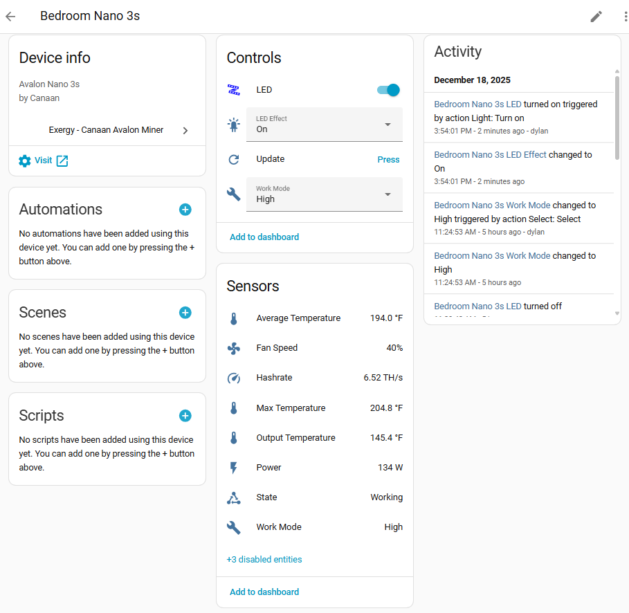
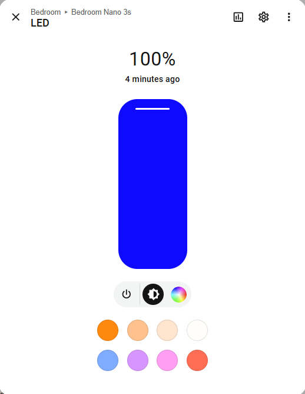

<!--explain in detail how to interact with, interperet sensor data, send commands, and view information for an avalon nano3s in ha using our canaan integration-->
# Canaan Avalon Nano 3s in Home Assistant

The Avalon Nano 3s is a compact, low-power bitcoin miner designed for desktop or small space heating, producing ~500 BTU/hr.

## Before You Start

Two steps before adding this miner to Home Assistant:

1. **Set up your miner with the Avalon Home App** - Configure WiFi and get your miner's IP address. Download from [Canaan](https://www.canaan.io/avalon-home).

2. **Install the Exergy Canaan integration** - Follow the [Canaan Avalon Home Integration](./exergy-canaan.md) guide to install via HACS and add your miner.

Once both are complete, your Nano 3s will appear in Home Assistant with the sensors and controls below.

## Specifications

| Spec | Value |
|------|-------|
| Hashrate | ~6 TH/s (varies by mode) |
| Power | ~150W |
| Heat Output | ~500 BTU/hr |
| Noise Level | ~40 dB |
| Dimensions | 150 x 100 x 100mm |
| Weight | ~1 kg |

## Work Modes

The Nano 3s supports three operating modes:

### High
- Maximum performance
- Standard fan operation
- Highest heat output

### Mid
- Balanced performance
- Standard operation

### Low
- Reduced noise
- Lower fan speeds
- Reduced hashrate

## Home Assistant Entities

### Sensors

| Sensor | Entity Example | Description |
|--------|----------------|-------------|
| Temperature | `sensor.avalon_nano_3s_temperature` | Device temperature |
| Hashrate | `sensor.avalon_nano_3s_hashrate` | Current TH/s |
| Power | `sensor.avalon_nano_3s_power` | Current wattage |
| Device State | `sensor.avalon_nano_3s_state` | Operating status |

### Controls

| Control | Entity Example | Options |
|---------|----------------|---------|
| Work Mode | `select.avalon_nano_3s_work_mode` | High, Medium, Low |
| Light Control | `light.avalon_nano_3s_led` | LED color selection |
| Light Effects | `light.avalon_nano_3s_led_effect` | Off, On, Flash, Breath, Loop |
| Reboot | `button.avalon_nano_3s_reboot` | Trigger reboot |

> **Note:** The Nano 3s API doesn't support power on/off control. We recommend pairing it with a smart outlet (WiFi or Zigbee) if you need remote power control.

## Heating Capacity

The Nano 3s produces approximately **500 BTU/hr**, similar to a small personal space heater.

**Suitable for:**
- Desktop/workspace warming
- Small enclosed spaces
- Supplemental heat source
- Learning/educational setups

**Not suitable for:**
- Room heating (output too low)
- Primary heating source

## Use Cases

### Personal Space Heater
- Place under desk or near workspace
- Low noise suitable for office environment
- Warms immediate area

### Entry-Level Mining
- Low power requirements (standard outlet)
- Quiet operation
- Learn bitcoin mining basics

### Multiple Unit Setups
- Combine several Nano units for distributed heating
- Each unit independently controlled

## Electrical Requirements

The Nano 3s has minimal power requirements:

- Standard 120V outlet
- ~1.5A draw
- No dedicated circuit needed
- Can share circuit with other devices

## What's Next?

### Add Power Control
The Nano 3s API doesn't support power on/off. To enable automation, pair with a smart outlet (WiFi or Zigbee) and use the outlet switch in place of a miner power switch in automations.

### Automate Your Miner
- [Time-of-Use Control](../blueprints/time-of-use.md) - Schedule around electricity rates or noise preferences

### Build a Dashboard
- [Space Heater Dashboard](../dashboards/space-heater.md) - Monitor temperature and mining stats
