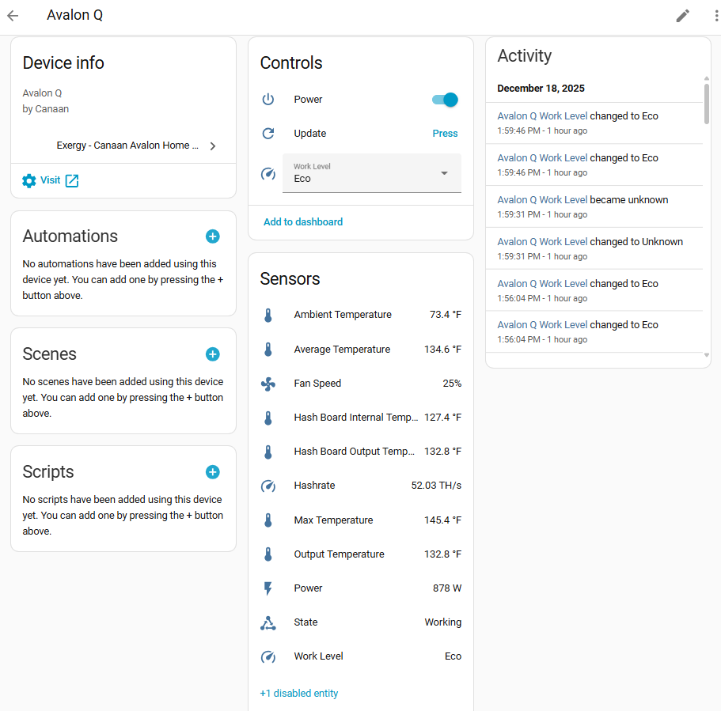

<!--explain in detail how to interact with, interperet sensor data, send commands, and view information for an avalon mini Q in ha using our canaan integration-->
# Canaan Avalon Q in Home Assistant

The Avalon Q is a higher-performance bitcoin miner suitable for larger heating applications, producing ~5,630 BTU/hr at full power.

## Before You Start

Two steps before adding this miner to Home Assistant:

1. **Set up your miner with the Avalon Home App** - Configure WiFi or ethernet and get your miner's IP address. Download from [Canaan](https://www.canaan.io/avalon-home).

2. **Install the Exergy Canaan integration** - Follow the [Canaan Avalon Home Integration](./exergy-canaan.md) guide to install via HACS and add your miner.

Once both are complete, your Avalon Q will appear in Home Assistant with the sensors and controls below.

## Specifications

| Spec | Value |
|------|-------|
| Hashrate | ~90 TH/s (varies by level) |
| Power | ~1,650W |
| Heat Output | ~5,630 BTU/hr |
| Noise Level | ~65 dB |
| Dimensions | 400 x 200 x 290mm |
| Weight | ~12 kg |

## Work Levels

The Avalon Q supports three performance levels:

### Super
- ~1,700W power consumption
- Maximum heat output
- Full fan speed
- Highest hashrate

### Standard
- ~1,300W power consumption
- Balanced performance
- Slightly reduced fan speed
- Medium hashrate

### Eco
- ~800W power consumption
- Reduced noise
- Lower fan speeds
- Lower hashrate and heat output

## Home Assistant Entities

### Sensors

| Sensor | Entity Example | Description |
|--------|----------------|-------------|
| Ambient Temperature | `sensor.avalon_q_ambient_temperature` | Intake air temp |
| Output Temperature | `sensor.avalon_q_output_temperature` | Exhaust air temp |
| Hashboard Temperature | `sensor.avalon_q_hash_board_temperature` | Internal chip temp |
| Hashrate | `sensor.avalon_q_hashrate` | Current TH/s |
| Power | `sensor.avalon_q_power` | Current wattage |
| Fan Speed | `sensor.avalon_q_fan_speed` | Fan RPM % |
| Device State | `sensor.avalon_q_state` | Operating status |

### Controls

| Control | Entity Example | Options |
|---------|----------------|---------|
| Power | `switch.avalon_q_power` | On/Off |
| Work Level | `select.avalon_q_work_level` | Eco, Standard, Super |
| Reboot | `button.avalon_q_reboot` | Trigger reboot |

## Heating Capacity

The Avalon Q produces approximately **5,630 BTU/hr** at full power, comparable to a large space heater or small HVAC system.

**Suitable for:**
- Large room heating (400-800 sq ft)
- Basement or garage heating
- HVAC duct integration

**Considerations:**
- Requires 15A dedicated circuit
- Higher noise level than Mini 3
- Significant heat output

## HVAC Integration

The Avalon Q is well-suited for integration with existing HVAC systems:

- Output can be ducted into supply plenum
- Acts as "Stage 1" heating with fossil fuel as "Stage 2"
- Requires proper airflow management

See [HVAC Integrated Thermostat Control](../blueprints/hvac.md) for automation setup and [HVAC Dashboard](../dashboards/hvac.md) for a matching interface.

## What's Next?

### Automate Your Heating
- [HVAC Integrated Control](../blueprints/hvac.md) - Whole-home thermostat integration
- [Space Heater Control](../blueprints/space-heater.md) - Standalone room heating
- [Time-of-Use Control](../blueprints/time-of-use.md) - Optimize around electricity rates

### Build a Dashboard
- [HVAC Dashboard](../dashboards/hvac.md) - Thermostat + stage indicators
- [Upstairs Example](../dashboards/upstairs.md) - Real Avalon Q + furnace setup
