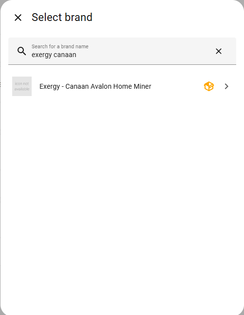
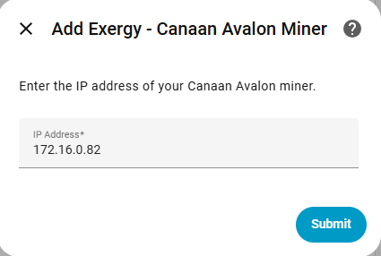
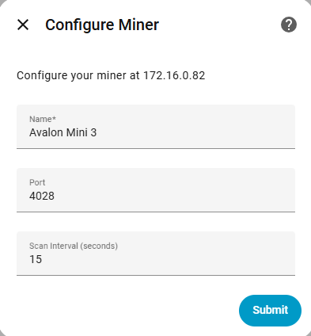
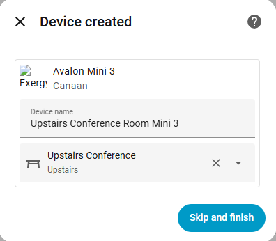
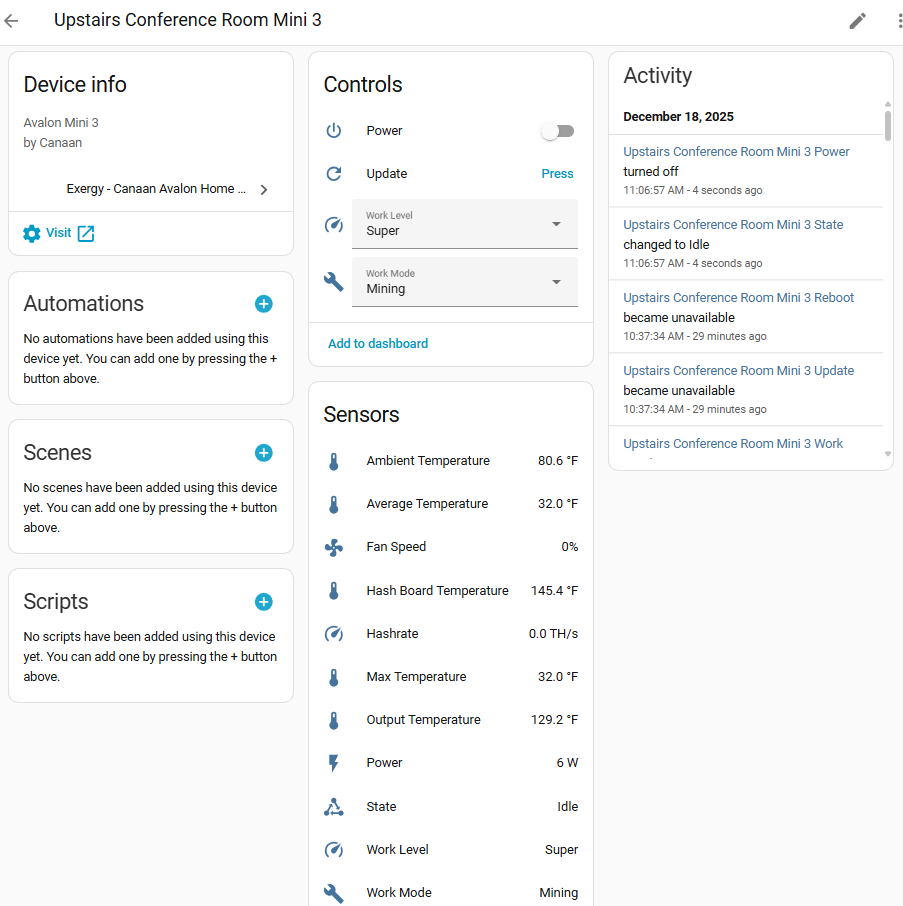

<!--explain in a detailed manner what the canaan avalon home miner integration does, how to install it and use it-->
# Canaan Avalon Home - Exergy Home Assistant Integration

This integration connects Canaan Avalon home miners to Home Assistant, giving you full control and monitoring through the same interface you use for your other smart home devices.

## What This Integration Does

Once installed, your miner becomes a controllable device in Home Assistant with:

- **Power control** - Turn your miner on and off
- **Operating modes** - Switch between Heating, Mining, and Night modes
- **Performance levels** - Toggle between Eco and Super
- **Real-time monitoring** - Temperatures, hashrate, power consumption, fan speeds
- **Automation support** - Control your miner based on temperature, time, electricity rates, or any trigger

## Supported Hardware

| Miner | Hashrate | Heat Output | Best For |
|-------|----------|-------------|----------|
| [Avalon Mini 3](./avalon-mini-3.md) | ~37 TH/s | ~2,900 BTU/hr | Single room heating |
| [Avalon Q](./avalon-q.md) | ~90 TH/s | ~5,100 BTU/hr | Larger spaces, HVAC integration |
| [Avalon Nano 3s](./avalon-nano-3s.md) | ~6 TH/s | ~500 BTU/hr | Desktop/office warming |

Click each model for detailed specifications, available sensors, and control options.

## Installation

### Prerequisites

- **Home Assistant with HACS installed** - HACS is the Home Assistant Community Store where custom integrations are distributed. See our [system configuration guide](../brains/rpi-ha-config.md) if you need to install it.
- **Miner on the same network** - Your miner and Home Assistant need to communicate over your local network.
- **Miner's IP address** - See [Finding Your Miner's IP Address](#finding-your-miners-ip-address) below.

### Step 1: Install via HACS

1. Open Home Assistant
2. Navigate to **HACS → Integrations**
3. Click **+ Explore & Download Repositories**
4. Search for "Exergy Canaan"
5. Click **Download**
6. Restart Home Assistant

### Step 2: Add Your Miner

1. Go to **Settings → Devices & Services**
2. Click **+ Add Integration**
3. Search for "Exergy Canaan"

4. Enter your miner's IP address and click **Submit**

5. Configure your miner's connection settings:

| Setting | Default | Description |
|---------|---------|-------------|
| **Name** | — | How this miner appears in Home Assistant |
| **Port** | 4028 | CGMiner API port. Leave at default unless you've changed it on the miner. |
| **Scan Interval** | 15 sec | How often Home Assistant polls the miner for updates |

6. Give your device a friendly name (like "Upstairs Office Heater") and optionally assign it to an area.

### Step 3: Verify

Open the device page to see all available entities:

You should see:
- **Controls** - Power switch, work mode selector, work level selector
- **Sensors** - Temperatures, hashrate, power, fan speed, device state
- **Buttons** - Manual update, reboot

## Finding Your Miner's IP Address

### Method 1: Router Admin Panel

1. Log into your router's admin interface
2. Look for "Connected Devices" or "DHCP Leases"
3. Find the device named "Avalon" or similar
4. Note the IP address

### Method 2: Avalon Home App

1. Open the Avalon Home app
2. Connect to your miner
3. Find IP address in device settings

### Method 3: Network Scanner

Use a network scanning app:
- **Fing** (iOS/Android)
- **Advanced IP Scanner** (Windows)
- **nmap** (Linux/Mac)

**Tip:** Set a static IP or DHCP reservation for your miner to prevent the address from changing.

## Multiple Miners

Add each miner separately through the integration setup. Each appears as its own device with distinct entities. Name them to distinguish locations (e.g., "Office Mini 3" vs "Basement Mini 3").

## What's Next?

### Learn Your Miner's Capabilities
- [Avalon Mini 3](./avalon-mini-3.md) - Sensors, controls, work modes, heating capacity
- [Avalon Q](./avalon-q.md) - Higher performance unit details
- [Avalon Nano 3s](./avalon-nano-3s.md) - Desktop miner specifics

### Set Up Automated Heating
- [Space Heater Thermostat Control](../blueprints/space-heater.md) - Temperature-controlled operation
- [HVAC Integration](../blueprints/hvac.md) - Whole-home thermostat integration
- [Time-of-Use Control](../blueprints/time-of-use.md) - Optimize around electricity rates

### Build a Dashboard
- [Dashboard Templates](../dashboards/overview.md) - Pre-built monitoring interfaces

## Troubleshooting

### Integration not finding miner

1. Verify miner is powered on and connected to network
2. Confirm IP address is correct
3. Try accessing miner's web interface directly (`http://[IP_ADDRESS]`)
4. Check that HA and miner are on the same network/VLAN

### Entities showing "Unavailable"

1. Ping the miner's IP to confirm it's online
2. Reload the integration: **Settings → Devices & Services → Exergy Canaan → ⋮ → Reload**
3. Check Home Assistant logs for error messages

### Slow updates

- Default scan interval is 15 seconds
- Commands execute within a few seconds
- If persistently slow, check network connectivity

## Source Code & Support

- **GitHub:** [github.com/exergyheat/ha-integration-canaan-avalon-home](https://github.com/exergyheat/ha-integration-canaan-avalon-home)
- **Support Forum:** [support.exergyheat.com/c/sw-support](https://support.exergyheat.com/c/sw-support/14)
